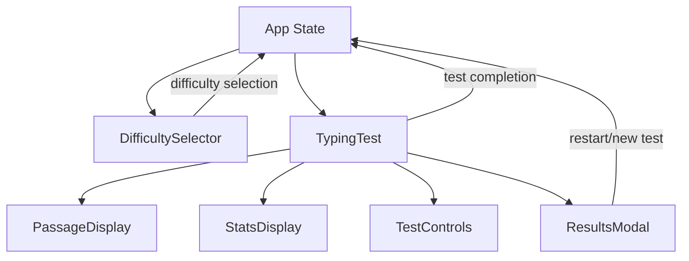
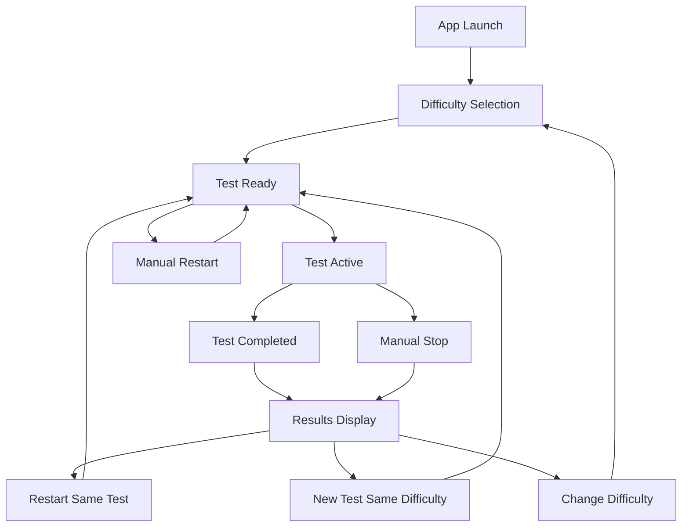

# Typing Speed Test Application - Technical Specification

## Overview

This document outlines the complete architecture for an interactive typing test application built with React and Vite. The application provides a clean, minimal interface for users to test their typing speed with pre-defined text passages across different difficulty levels.

## Requirements Summary

- **Difficulty Levels**: Single difficulty selection with beginner, intermediate, and advanced passages
- **Timing**: Fixed 60-second duration with automatic completion
- **Persistence**: Session-only results (no data persistence)
- **Design**: Minimal, clean interface with subtle animations and dark/light theme support
- **Technology Stack**: React 19, Vite, CSS Modules/vanilla CSS

---

## Component Architecture

### Component Hierarchy

```
App
├── Header
├── DifficultySelector
├── TypingTest
│   ├── PassageDisplay
│   │   ├── CharacterSpan (multiple instances)
│   │   └── Cursor
│   ├── TypingInput
│   ├── StatsDisplay
│   │   ├── Timer
│   │   ├── WPMCounter
│   │   ├── AccuracyMeter
│   │   └── ProgressBar
│   └── TestControls
└── ResultsModal
    ├── ResultsSummary
    ├── DetailedStats
    └── ActionButtons
```

### Component Specifications

#### 1. App Component
**Purpose**: Root component managing global application state and routing between different views.

**State**:
```javascript
{
  currentView: 'difficulty-selection' | 'typing-test' | 'results',
  selectedDifficulty: 'beginner' | 'intermediate' | 'advanced' | null,
  testResults: TestResult | null,
  theme: 'light' | 'dark'
}
```

**Props**: None (root component)

**Responsibilities**:
- Manage application-wide state
- Handle view transitions
- Provide theme context
- Coordinate between major application sections

#### 2. Header Component
**Purpose**: Display application title and theme toggle.

**Props**:
```javascript
{
  theme: 'light' | 'dark',
  onThemeToggle: () => void
}
```

**State**: None (stateless)

**Responsibilities**:
- Display application branding
- Provide theme switching functionality
- Maintain consistent header across all views

#### 3. DifficultySelector Component
**Purpose**: Allow users to choose passage difficulty level.

**Props**:
```javascript
{
  onDifficultySelect: (difficulty: 'beginner' | 'intermediate' | 'advanced') => void,
  selectedDifficulty: string | null
}
```

**State**: None (controlled component)

**Responsibilities**:
- Display difficulty options with descriptions
- Handle difficulty selection
- Provide visual feedback for selection
- Show sample text preview for each difficulty

#### 4. TypingTest Component
**Purpose**: Main testing interface coordinating all test-related components.

**Props**:
```javascript
{
  difficulty: 'beginner' | 'intermediate' | 'advanced',
  onTestComplete: (results: TestResult) => void,
  onRestart: () => void
}
```

**State**:
```javascript
{
  currentPassage: PassageData,
  userInput: string,
  currentPosition: number,
  testStatus: 'ready' | 'active' | 'completed',
  startTime: number | null,
  timeRemaining: number,
  errors: ErrorData[],
  wpm: number,
  accuracy: number
}
```

**Responsibilities**:
- Manage test lifecycle (start, progress, completion)
- Coordinate between child components
- Calculate real-time statistics
- Handle test timing and auto-completion

#### 5. PassageDisplay Component
**Purpose**: Render the text passage with character-level styling and cursor.

**Props**:
```javascript
{
  passage: string,
  userInput: string,
  currentPosition: number,
  isActive: boolean
}
```

**State**: None (controlled component)

**Responsibilities**:
- Render individual characters with appropriate styling
- Show correct, incorrect, and untyped characters
- Display typing cursor at current position
- Provide visual feedback for typing progress

#### 6. CharacterSpan Component
**Purpose**: Individual character rendering with state-based styling.

**Props**:
```javascript
{
  character: string,
  status: 'untyped' | 'correct' | 'incorrect',
  isCurrent: boolean
}
```

**State**: None (stateless)

**Responsibilities**:
- Render single character with appropriate styling
- Handle special characters (spaces, punctuation)
- Provide accessibility attributes

#### 7. Cursor Component
**Purpose**: Animated typing cursor indicator.

**Props**:
```javascript
{
  isActive: boolean,
  position: { x: number, y: number }
}
```

**State**: None (stateless)

**Responsibilities**:
- Display blinking cursor animation
- Position cursor at current typing location
- Handle cursor visibility based on test state

#### 8. TypingInput Component
**Purpose**: Invisible input handler for capturing keystrokes.

**Props**:
```javascript
{
  value: string,
  onChange: (value: string) => void,
  onKeyDown: (event: KeyboardEvent) => void,
  isDisabled: boolean,
  autoFocus: boolean
}
```

**State**: None (controlled component)

**Responsibilities**:
- Capture all keyboard input
- Handle special keys (backspace, space, etc.)
- Maintain focus during test
- Prevent unwanted browser shortcuts

#### 9. StatsDisplay Component
**Purpose**: Real-time statistics display container.

**Props**:
```javascript
{
  wpm: number,
  accuracy: number,
  timeRemaining: number,
  progress: number
}
```

**State**: None (stateless)

**Responsibilities**:
- Layout statistics components
- Provide consistent styling for stats
- Handle responsive design for stats area

#### 10. Timer Component
**Purpose**: Countdown timer display.

**Props**:
```javascript
{
  timeRemaining: number,
  totalTime: number,
  isActive: boolean
}
```

**State**: None (stateless)

**Responsibilities**:
- Display formatted time (MM:SS)
- Provide visual urgency indicators
- Handle timer animations

#### 11. WPMCounter Component
**Purpose**: Words per minute display with smooth updates.

**Props**:
```javascript
{
  wpm: number,
  isActive: boolean
}
```

**State**:
```javascript
{
  displayWpm: number,
  animationId: number | null
}
```

**Responsibilities**:
- Smooth WPM number transitions
- Handle real-time updates
- Provide visual emphasis for high speeds

#### 12. AccuracyMeter Component
**Purpose**: Accuracy percentage with visual indicator.

**Props**:
```javascript
{
  accuracy: number,
  isActive: boolean
}
```

**State**: None (stateless)

**Responsibilities**:
- Display accuracy percentage
- Provide color-coded feedback
- Show accuracy trends

#### 13. ProgressBar Component
**Purpose**: Visual progress indicator for test completion.

**Props**:
```javascript
{
  progress: number,
  timeProgress: number,
  isActive: boolean
}
```

**State**: None (stateless)

**Responsibilities**:
- Show typing progress as percentage
- Display time progress
- Provide smooth progress animations

#### 14. TestControls Component
**Purpose**: Test control buttons (start, restart, etc.).

**Props**:
```javascript
{
  testStatus: 'ready' | 'active' | 'completed',
  onStart: () => void,
  onRestart: () => void,
  onStop: () => void
}
```

**State**: None (stateless)

**Responsibilities**:
- Provide test control actions
- Handle button state based on test status
- Offer keyboard shortcuts

#### 15. ResultsModal Component
**Purpose**: Test completion results display.

**Props**:
```javascript
{
  results: TestResult,
  isOpen: boolean,
  onClose: () => void,
  onRestart: () => void,
  onNewTest: () => void
}
```

**State**:
```javascript
{
  animationPhase: 'entering' | 'visible' | 'exiting'
}
```

**Responsibilities**:
- Display comprehensive test results
- Handle modal animations
- Provide action buttons for next steps
- Show celebratory effects for good performance

#### 16. ResultsSummary Component
**Purpose**: Primary results display (WPM, accuracy, time).

**Props**:
```javascript
{
  wpm: number,
  accuracy: number,
  timeElapsed: number,
  difficulty: string
}
```

**State**: None (stateless)

**Responsibilities**:
- Display key performance metrics
- Provide performance level indicators
- Show improvement suggestions

#### 17. DetailedStats Component
**Purpose**: Detailed performance breakdown.

**Props**:
```javascript
{
  totalCharacters: number,
  correctCharacters: number,
  incorrectCharacters: number,
  totalWords: number,
  errors: ErrorData[],
  wpmHistory: number[]
}
```

**State**: None (stateless)

**Responsibilities**:
- Show detailed typing statistics
- Display error analysis
- Provide performance insights

#### 18. ActionButtons Component
**Purpose**: Post-test action buttons.

**Props**:
```javascript
{
  onRestart: () => void,
  onNewTest: () => void,
  onChangeDifficulty: () => void
}
```

**State**: None (stateless)

**Responsibilities**:
- Provide clear next action options
- Handle button styling and layout
- Offer keyboard navigation

---

## State Management Strategy

### Global State (App Level)
- **Application View**: Current screen/mode
- **Selected Difficulty**: User's chosen difficulty level
- **Test Results**: Completed test data
- **Theme Preference**: Light/dark mode

### Local State Distribution

#### TypingTest Component (Primary State Hub)
- **Test Progress**: Current position, user input, timing
- **Real-time Metrics**: WPM, accuracy, errors
- **Test Status**: Ready, active, completed states

#### Component-Specific State
- **WPMCounter**: Smooth animation state
- **ResultsModal**: Animation phase state
- **Cursor**: Position and visibility state

### State Flow Patterns



### Performance Considerations
- **Debounced Updates**: WPM calculations throttled to prevent excessive re-renders
- **Memoization**: Character components memoized to prevent unnecessary re-renders
- **Event Batching**: Multiple state updates batched in single render cycle

---

## User Experience Flow

### Application States

#### 1. Initial State (Difficulty Selection)
- **View**: Difficulty selection screen
- **User Actions**: Choose difficulty level
- **Transitions**: → Typing Test (Ready)

#### 2. Typing Test (Ready)
- **View**: Test interface with passage displayed
- **User Actions**: Click start or begin typing
- **Transitions**: → Typing Test (Active)

#### 3. Typing Test (Active)
- **View**: Active test with real-time feedback
- **User Actions**: Type passage, view progress
- **Transitions**: → Typing Test (Completed) or Results Modal

#### 4. Typing Test (Completed)
- **View**: Results modal with performance data
- **User Actions**: Review results, choose next action
- **Transitions**: → Difficulty Selection or Typing Test (Ready)

### User Journey Flow



### Interaction Patterns

#### Keyboard Interactions
- **Typing**: All alphanumeric and punctuation keys
- **Backspace**: Correct mistakes (limited backtracking)
- **Escape**: Stop current test
- **Enter**: Start test when ready
- **Tab**: Navigate between buttons (accessibility)

#### Mouse/Touch Interactions
- **Click**: Button interactions, difficulty selection
- **Focus**: Automatic input focus management
- **Hover**: Button and option hover states

### Feedback Mechanisms

#### Visual Feedback
- **Character States**: Color coding for correct/incorrect/untyped
- **Progress Indicators**: Real-time progress bar and statistics
- **Cursor Animation**: Smooth cursor movement and blinking
- **Button States**: Clear active/inactive/hover states

#### Performance Feedback
- **Real-time Stats**: Live WPM and accuracy updates
- **Error Highlighting**: Immediate visual error indication
- **Completion Celebration**: Subtle success animations
- **Progress Motivation**: Visual progress encouragement

---

## Technical Specifications

### Data Structures

#### PassageData
```javascript
interface PassageData {
  id: string;
  difficulty: 'beginner' | 'intermediate' | 'advanced';
  text: string;
  wordCount: number;
  averageWordLength: number;
  commonWords: string[];
  punctuationDensity: number;
  metadata: {
    source?: string;
    category?: string;
    estimatedWPM: number;
  };
}
```

#### TestResult
```javascript
interface TestResult {
  id: string;
  timestamp: number;
  difficulty: string;
  passage: PassageData;
  performance: {
    wpm: number;
    accuracy: number;
    timeElapsed: number;
    totalCharacters: number;
    correctCharacters: number;
    incorrectCharacters: number;
    totalWords: number;
  };
  errors: ErrorData[];
  wpmHistory: WPMDataPoint[];
}
```

#### ErrorData
```javascript
interface ErrorData {
  position: number;
  expectedCharacter: string;
  typedCharacter: string;
  timestamp: number;
  corrected: boolean;
}
```

#### WPMDataPoint
```javascript
interface WPMDataPoint {
  timestamp: number;
  wpm: number;
  accuracy: number;
  position: number;
}
```

### Calculation Algorithms

#### WPM Calculation
```javascript
function calculateWPM(correctCharacters, timeElapsedSeconds) {
  const wordsTyped = correctCharacters / 5; // Standard: 5 characters = 1 word
  const minutes = timeElapsedSeconds / 60;
  return Math.round(wordsTyped / minutes);
}
```

#### Accuracy Calculation
```javascript
function calculateAccuracy(correctCharacters, totalCharacters) {
  if (totalCharacters === 0) return 100;
  return Math.round((correctCharacters / totalCharacters) * 100);
}
```

#### Progress Calculation
```javascript
function calculateProgress(currentPosition, totalLength) {
  return Math.min((currentPosition / totalLength) * 100, 100);
}
```

### Animation Specifications

#### Cursor Animation
- **Blink Rate**: 1.2 seconds cycle
- **Active State**: Solid during typing
- **Inactive State**: Blinking when idle
- **Transition**: Smooth position changes (0.1s ease)

#### WPM Counter Animation
- **Update Frequency**: Every 100ms during active typing
- **Smoothing**: Linear interpolation between values
- **Duration**: 0.3s transition for value changes

#### Progress Bar Animation
- **Update Rate**: Real-time with typing
- **Easing**: Ease-out for smooth progress
- **Color Transitions**: Gradient based on completion percentage

#### Results Modal Animation
- **Entry**: Fade in with scale (0.3s ease-out)
- **Exit**: Fade out with scale (0.2s ease-in)
- **Content**: Staggered animation for statistics (0.1s delays)

### Responsive Design Requirements

#### Breakpoints
- **Mobile**: 320px - 768px
- **Tablet**: 769px - 1024px
- **Desktop**: 1025px+

#### Layout Adaptations
- **Mobile**: Single column, larger touch targets
- **Tablet**: Optimized spacing, medium touch targets
- **Desktop**: Full layout, precise mouse interactions

#### Typography Scaling
- **Mobile**: 16px base, 1.2rem passage text
- **Tablet**: 16px base, 1.4rem passage text
- **Desktop**: 16px base, 1.6rem passage text

---

## File Structure

```
src/
├── components/
│   ├── common/
│   │   ├── Header/
│   │   │   ├── Header.jsx
│   │   │   ├── Header.module.css
│   │   │   └── index.js
│   │   ├── Button/
│   │   │   ├── Button.jsx
│   │   │   ├── Button.module.css
│   │   │   └── index.js
│   │   └── Modal/
│   │       ├── Modal.jsx
│   │       ├── Modal.module.css
│   │       └── index.js
│   ├── difficulty/
│   │   ├── DifficultySelector/
│   │   │   ├── DifficultySelector.jsx
│   │   │   ├── DifficultySelector.module.css
│   │   │   └── index.js
│   │   └── DifficultyCard/
│   │       ├── DifficultyCard.jsx
│   │       ├── DifficultyCard.module.css
│   │       └── index.js
│   ├── typing/
│   │   ├── TypingTest/
│   │   │   ├── TypingTest.jsx
│   │   │   ├── TypingTest.module.css
│   │   │   └── index.js
│   │   ├── PassageDisplay/
│   │   │   ├── PassageDisplay.jsx
│   │   │   ├── PassageDisplay.module.css
│   │   │   ├── CharacterSpan.jsx
│   │   │   ├── Cursor.jsx
│   │   │   └── index.js
│   │   ├── TypingInput/
│   │   │   ├── TypingInput.jsx
│   │   │   ├── TypingInput.module.css
│   │   │   └── index.js
│   │   ├── StatsDisplay/
│   │   │   ├── StatsDisplay.jsx
│   │   │   ├── StatsDisplay.module.css
│   │   │   ├── Timer.jsx
│   │   │   ├── WPMCounter.jsx
│   │   │   ├── AccuracyMeter.jsx
│   │   │   ├── ProgressBar.jsx
│   │   │   └── index.js
│   │   └── TestControls/
│   │       ├── TestControls.jsx
│   │       ├── TestControls.module.css
│   │       └── index.js
│   └── results/
│       ├── ResultsModal/
│       │   ├── ResultsModal.jsx
│       │   ├── ResultsModal.module.css
│       │   └── index.js
│       ├── ResultsSummary/
│       │   ├── ResultsSummary.jsx
│       │   ├── ResultsSummary.module.css
│       │   └── index.js
│       ├── DetailedStats/
│       │   ├── DetailedStats.jsx
│       │   ├── DetailedStats.module.css
│       │   └── index.js
│       └── ActionButtons/
│           ├── ActionButtons.jsx
│           ├── ActionButtons.module.css
│           └── index.js
├── hooks/
│   ├── useTimer.js
│   ├── useTypingTest.js
│   ├── useKeyboardInput.js
│   ├── useWPMCalculation.js
│   ├── useAccuracyTracking.js
│   └── useTheme.js
├── utils/
│   ├── calculations.js
│   ├── textProcessing.js
│   ├── keyboardUtils.js
│   ├── animationUtils.js
│   └── constants.js
├── data/
│   ├── passages/
│   │   ├── beginner.js
│   │   ├── intermediate.js
│   │   ├── advanced.js
│   │   └── index.js
│   └── themes/
│       ├── lightTheme.js
│       ├── darkTheme.js
│       └── index.js
├── styles/
│   ├── globals.css
│   ├── variables.css
│   ├── animations.css
│   ├── responsive.css
│   └── themes.css
├── App.jsx
├── App.module.css
├── main.jsx
└── index.css
```

### File Organization Principles

#### Component Structure
- **Component Folder**: Each component in its own directory
- **Index File**: Clean imports with index.js barrel exports
- **CSS Modules**: Scoped styling with .module.css files
- **Co-location**: Related files grouped together

#### Utility Organization
- **Hooks**: Reusable stateful logic
- **Utils**: Pure functions and helpers
- **Data**: Static data and configuration
- **Styles**: Global styles and theme definitions

#### Import Strategy
- **Absolute Imports**: Configured for clean import paths
- **Barrel Exports**: Index files for clean component imports
- **Tree Shaking**: Optimized imports for bundle size

---

## Implementation Guidelines

### Development Phases

#### Phase 1: Core Structure
1. Set up component hierarchy
2. Implement basic routing between views
3. Create static layouts for all major components
4. Establish theme system and basic styling

#### Phase 2: Typing Engine
1. Implement text passage display
2. Create keyboard input handling
3. Build character-by-character comparison logic
4. Add real-time visual feedback

#### Phase 3: Statistics & Timing
1. Implement timer functionality
2. Add WPM calculation engine
3. Create accuracy tracking system
4. Build progress indicators

#### Phase 4: User Experience
1. Add smooth animations and transitions
2. Implement results modal with detailed stats
3. Create responsive design adaptations
4. Add accessibility features

#### Phase 5: Polish & Optimization
1. Performance optimization
2. Error handling and edge cases
3. Cross-browser testing
4. Final UI/UX refinements

### Code Quality Standards

#### React Best Practices
- **Functional Components**: Use hooks for all components
- **PropTypes**: Type checking for all props
- **Memoization**: React.memo for performance-critical components
- **Custom Hooks**: Extract reusable logic

#### Performance Considerations
- **Debouncing**: Throttle expensive calculations
- **Virtual Scrolling**: For large text passages (if needed)
- **Code Splitting**: Lazy load non-critical components
- **Bundle Optimization**: Tree shaking and minification

#### Accessibility Requirements
- **Keyboard Navigation**: Full keyboard accessibility
- **Screen Readers**: ARIA labels and semantic HTML
- **Focus Management**: Proper focus handling
- **Color Contrast**: WCAG AA compliance

### Testing Strategy

#### Unit Testing
- **Component Testing**: Individual component functionality
- **Hook Testing**: Custom hook behavior
- **Utility Testing**: Pure function testing
- **Calculation Testing**: WPM and accuracy algorithms

#### Integration Testing
- **User Flow Testing**: Complete typing test scenarios
- **State Management**: Component interaction testing
- **Event Handling**: Keyboard and mouse interactions

#### Performance Testing
- **Render Performance**: Component re-render optimization
- **Memory Usage**: Memory leak detection
- **Bundle Size**: Build output analysis

---

## Conclusion

This technical specification provides a comprehensive blueprint for implementing a clean, performant typing speed test application. The architecture emphasizes:

- **Modularity**: Clear component separation and reusability
- **Performance**: Optimized for real-time interactions
- **User Experience**: Smooth, intuitive interface design
- **Maintainability**: Well-organized code structure
- **Accessibility**: Inclusive design principles

The specification balances simplicity with functionality, providing a solid foundation for implementation while maintaining flexibility for future enhancements.

---

## Next Steps

1. **Review and Approval**: Validate architectural decisions
2. **Environment Setup**: Configure development tools and dependencies
3. **Component Implementation**: Begin with core components
4. **Iterative Development**: Build and test incrementally
5. **User Testing**: Gather feedback and refine experience

This specification serves as the definitive guide for the development team, ensuring consistent implementation and high-quality results.